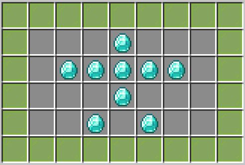

# 🎬 视图

菜单系统的第一层配置决定了菜单的整体外观和布局结构。每个菜单文件都需要配置标题、布局和刷新参数。

## 📋 配置结构

**示例:**

```yaml
title: "KaGuilds!"
layout:
  - "XXXXXXXXX"
  - "X...1...X"
  - "X.11111.X"
  - "X...1...X"
  - "X..1.1..X"
  - "XXXXXXXXX"
buttons:
  1:
    display:
      material: DIAMOND
      name: " "
  X:
    display:
      material: LIME_STAINED_GLASS_PANE
      name: " "
```

**预览:**



## 🔧 配置选项详解

### title - 菜单标题

定义菜单 GUI 顶部显示的标题文本。

**类型:** `String`

**格式:** 支持颜色代码（使用 `&` 符号）和 PlaceholderAPI 变量

**示例:**

```yaml
title: "&a公会主菜单"
```

```yaml
title: "&6&l{guild_name} - 成员列表"
```

```yaml
title: "&eBuff商店 &7(第 &f{page}&7 页)"
```

**注意事项:**

* 标题长度有限制,过长的标题会被截断
* 支持 PAPI 变量: `%player_name%`、`%player_level%` 等
* 支持插件内部变量: `{player}`、`{guild_name}`、`{page}` 等

***

### layout - 虚拟视图

定义菜单的布局结构,使用字符表示不同的图标位置。

**类型:** `List<String>`

**格式:** 每行代表 GUI 的一行,每行 9 个字符对应 GUI 的 9 个槽位

**示例:**

```yaml
# 4 行布局 (36 槽)
layout:
  - "XXXXXXXXX"  # 第 1 行
  - "X.......X"  # 第 2 行
  - "X.......X"  # 第 3 行
  - "XXXXXXXXX"  # 第 4 行

```

```yaml
# 6 行布局 (54 槽)
layout:
  - "NNNNNNNNN"
  - "N       N"
  - "N A B C N"
  - "N D E F N"
  - "N       N"
  - "NNNNNNNNN"
```

**字符说明:**

| 字符      | 说明                               |
| ------- | -------------------------------- |
| 空格      | 空槽位,不显示任何物品                      |
| X/A/B/C | 任意字符,用于标识按钮位置,对应 `buttons` 节点的键名 |

**重要规则:**

* 每行必须是恰好 9 个字符
* 行数决定了 GUI 大小: 1 行 = 9 槽, 2 行 = 18 槽, ..., 6 行 = 54 槽
* 空格字符表示空槽位
* 其他字符必须在 `buttons` 节点中有对应配置

***

### update - 刷新间隔

定义菜单内容的自动刷新周期(以 tick 为单位)。

**类型:** `Long`

**单位:** Minecraft tick (1 tick = 0.05 秒, 20 tick = 1 秒)

**默认值:** `0` (不自动刷新)

**示例:**

```yaml
# 每 1 秒刷新一次
update: 20
```

```yaml
# 每 5 秒刷新一次
update: 100
```

```yaml
# 不自动刷新
update: 0
```

```yaml
# 每 0.5 秒刷新一次
update: 10
```

**刷新内容:**

刷新功能会更新以下内容:
 
1. **动态变量**
   * PAPI 变量: `%player_level%`、`%player_health%` 等
   * 插件内部变量: `{balance}`、`{online}`、`{online}` 等
2. **动态列表**
   * 成员列表 (`MEMBERS_LIST`)
   * 公会列表 (`GUILDS_LIST`)
   * 玩家列表 (`ALL_PLAYER`)
   * Buff 列表 (`BUFF_LIST`)
   * 仓库列表 (`GUILD_VAULTS`)
   * 升级列表 (`GUILD_UPGRADE`)
   * 任务列表 (`TASK_DAILY`、`TASK_GLOBAL`)

**性能注意事项:**

* 刷新间隔过短会增加服务器负担
* 动态列表菜单(如成员列表)会从数据库查询数据
* 建议根据实际需求选择合适的刷新间隔

## 🔄 重新加载配置

修改菜单配置后,重新打开菜单会自动重新加载。
